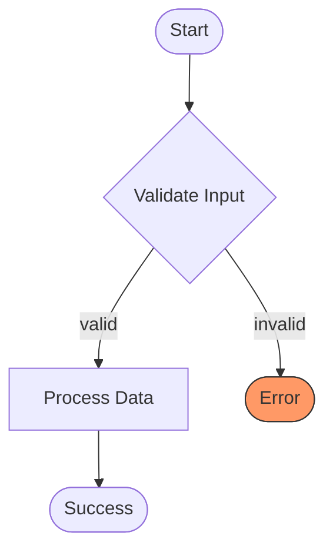
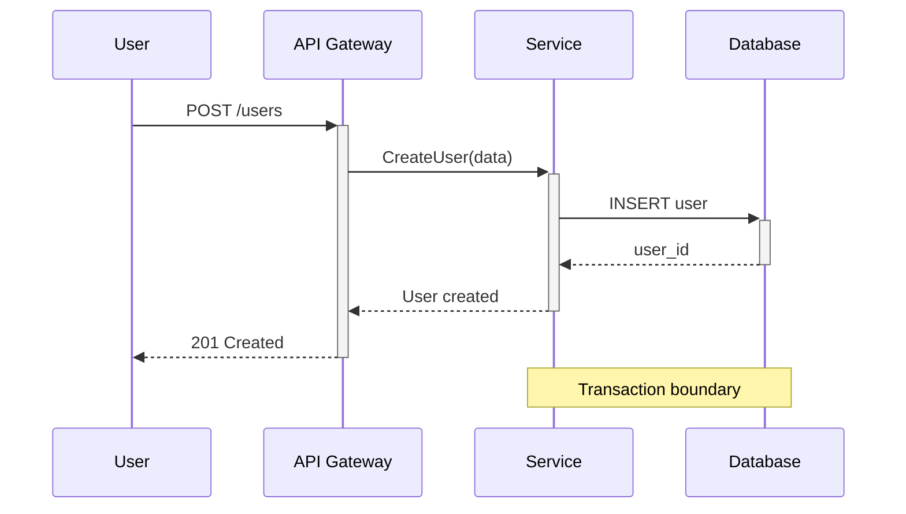
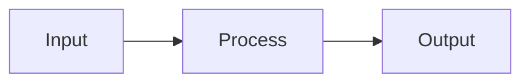
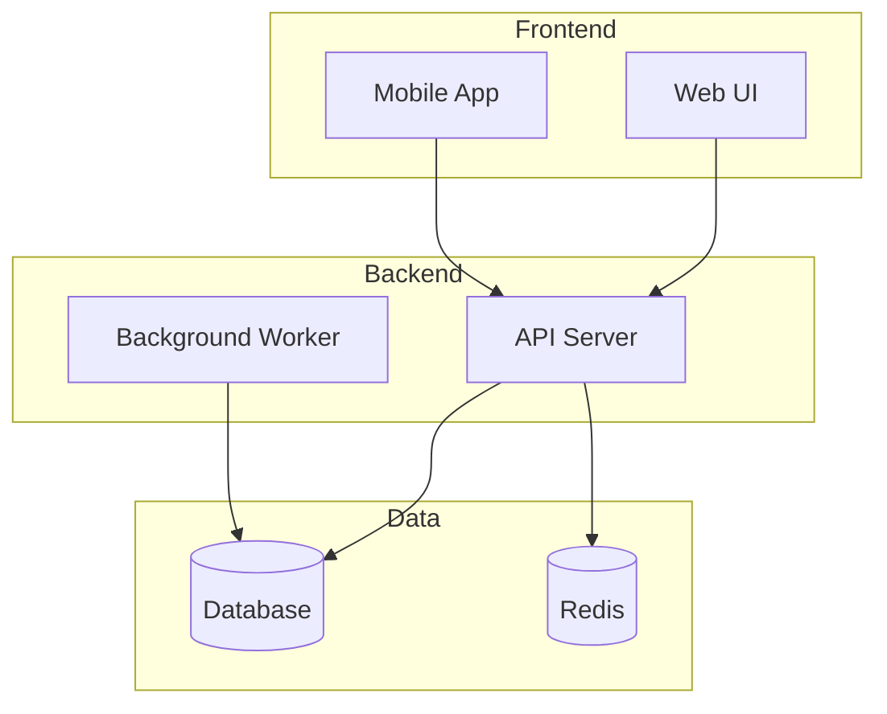
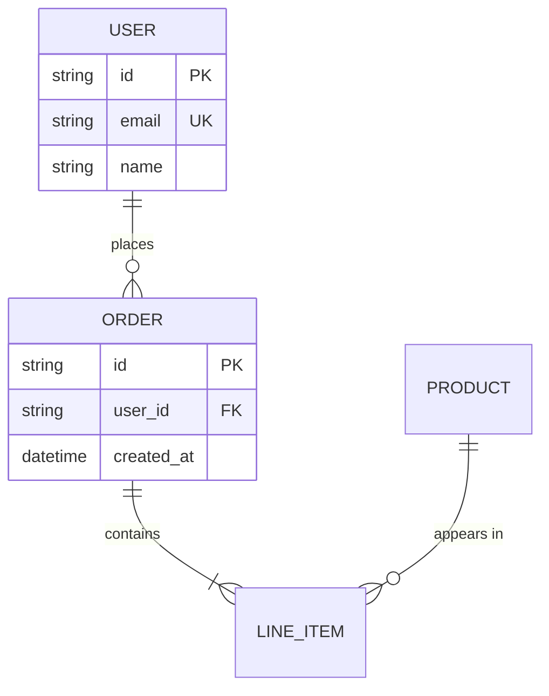
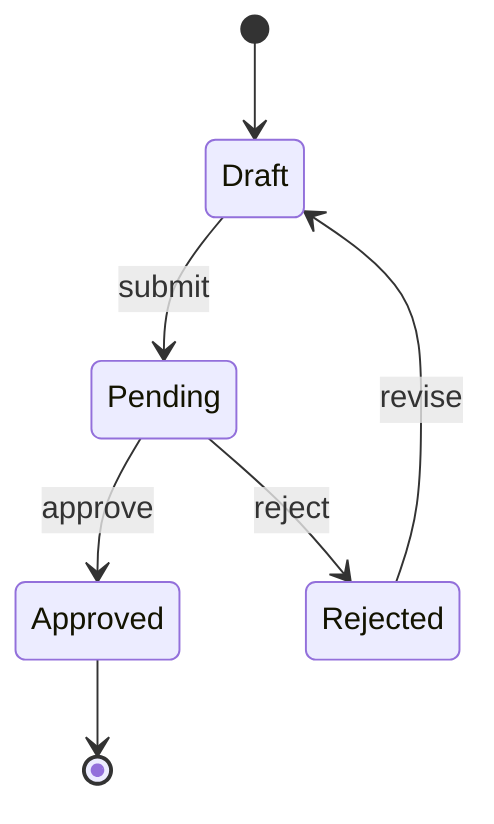

<!-- managed by rules — changes will be overwritten by /rules:init -->
---
paths:
  - "**/*.mermaid"
  - "**/*.mmd"
---

# Mermaid Diagram Standards

## Core Requirements

- **MUST** keep diagrams simple (< 15 nodes recommended)
- **MUST** use consistent naming conventions
- **MUST** use comments (`%%`) to document purpose
- **MUST** declare all nodes at the beginning before relationships
- **MUST** use descriptive node IDs (not A, B, C)
- **SHOULD** use classes for consistent styling
- **SHOULD** break complex diagrams into smaller components
- **SHOULD** use `elk` renderer for complex diagrams (9.4+)

## Diagram Type Selection

| Use Case | Diagram Type |
|----------|--------------|
| Process flows | `flowchart` |
| Sequential steps | `sequenceDiagram` |
| State machines | `stateDiagram-v2` |
| Class relationships | `classDiagram` |
| Data models | `erDiagram` |
| Timelines | `gantt` or `timeline` |
| Git history | `gitGraph` |
| Mindmaps | `mindmap` |
| Architecture | `C4Context` (C4 extension) |

## Flowchart Template



## Sequence Diagram Template



## Styling Best Practices


## Complexity Guidelines

### Keep It Simple


### Split Complex Diagrams
```mermaid
%% Instead of one huge diagram, create linked diagrams:
%% 1. system-overview.mmd (high-level)
%% 2. auth-flow.mmd (detailed auth)
%% 3. data-flow.mmd (detailed data)
```

## Layout Tips



## Entity Relationship



## State Diagram



## Integration in Markdown

````markdown
## Architecture Overview


See [detailed auth flow](./auth-flow.md) for authentication details.
````

## Anti-patterns

- ❌ Single-letter node IDs (`A`, `B`, `C`) - use descriptive names
- ❌ 20+ nodes in one diagram - split into multiple
- ❌ Missing comments - document complex logic
- ❌ Inline styles on every node - use `classDef`
- ❌ Inconsistent arrow styles - pick one convention
- ❌ Cramming everything into one diagram - link to details
